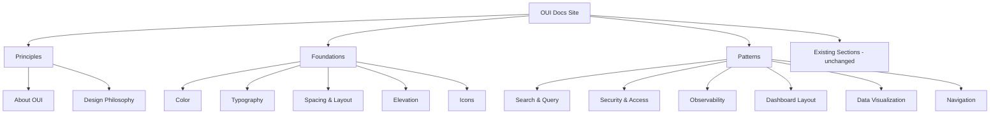
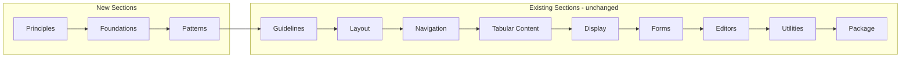

# Design Document: V9 Design System Docs

## Overview

This feature adds three new top-level documentation sections — Principles, Foundations, and Patterns — to the OUI docs site. These sections restructure the information architecture from a flat component catalog into a layered design-system reference, inspired by Datadog's DRUIDS approach but tailored for OpenSearch's focus areas: search, security, observability, and dashboarding.

The implementation follows the existing docs site conventions: React view components in `src-docs/src/views/`, registered in the `navigation` array in `src-docs/src/routes.js`, rendered through `GuidePage`, and routed via hash-based URLs. No changes to the build system, component library, or theme files are required — the new pages consume existing v9 theme tokens and OUI components.

## Architecture

### Information Architecture



### Navigation Integration

The new sections are inserted at the beginning of the `navigation` array in `routes.js`, before the existing "Guidelines" section. This positions design-system content prominently while preserving all existing routes.



### Page Rendering Strategy

Each new page uses one of two patterns already established in the codebase:

1. **Direct component pattern** (used by Guidelines > Colors, Guidelines > Sass): A React component is exported as default and registered directly in the navigation array. The component receives `selectedTheme` as a prop and renders content using `GuidePage` as its wrapper. This is the pattern used for all new pages since they are content-rich prose pages with embedded examples, not component API demos.

2. **createExample pattern** (used by all component pages): An example object with `title`, `sections`, and optional `playground`/`guidelines` is passed through `createExample()`. This pattern is not used for the new pages because they don't follow the component-demo structure.

## Components and Interfaces

### New View Directories

Each new page gets its own directory under `src-docs/src/views/`:

```
src-docs/src/views/
├── design_system_principles/
│   ├── about_oui.tsx              # About OUI page
│   └── design_philosophy.tsx      # Design Philosophy page
├── design_system_foundations/
│   ├── foundations_color.tsx       # Color foundations page
│   ├── foundations_typography.tsx  # Typography foundations page
│   ├── foundations_spacing.tsx     # Spacing & Layout page
│   ├── foundations_elevation.tsx   # Elevation page
│   └── foundations_icons.tsx       # Icons page
├── design_system_patterns/
│   ├── patterns_search_query.tsx       # Search & Query patterns
│   ├── patterns_security_access.tsx    # Security & Access patterns
│   ├── patterns_observability.tsx      # Observability patterns
│   ├── patterns_dashboard_layout.tsx   # Dashboard Layout patterns
│   ├── patterns_data_visualization.tsx # Data Visualization patterns
│   └── patterns_navigation.tsx         # Navigation patterns
```

### Page Component Interface

All new pages follow the same component signature, matching the direct component pattern used by existing guideline pages:

```typescript
interface ContentPageProps {
  selectedTheme: string; // e.g. "v9-light", "v9-dark", "light", "dark"
}

// Each page exports a default function component:
const AboutOui: React.FC<ContentPageProps> = ({ selectedTheme }) => {
  return (
    <GuidePage title="About OUI">
      {/* Page content using OUI components */}
    </GuidePage>
  );
};

export default AboutOui;
```

### Navigation Config Changes

The `navigation` array in `routes.js` gains three new entries at the top:

```javascript
const navigation = [
  {
    name: 'Principles',
    items: [
      { name: 'About OUI', component: AboutOui },
      { name: 'Design Philosophy', component: DesignPhilosophy },
    ],
  },
  {
    name: 'Foundations',
    items: [
      { name: 'Color', component: FoundationsColor },
      { name: 'Typography', component: FoundationsTypography },
      { name: 'Spacing & Layout', component: FoundationsSpacing },
      { name: 'Elevation', component: FoundationsElevation },
      { name: 'Icons', component: FoundationsIcons },
    ],
  },
  {
    name: 'Patterns',
    items: [
      { name: 'Search & Query', component: PatternsSearchQuery },
      { name: 'Security & Access', component: PatternsSecurityAccess },
      { name: 'Observability', component: PatternsObservability },
      { name: 'Dashboard Layout', component: PatternsDashboardLayout },
      { name: 'Data Visualization', component: PatternsDataVisualization },
      { name: 'Navigation', component: PatternsNavigation },
    ],
  },
  // ... existing sections unchanged
];
```

### URL Routing

Following the existing `{section-slug}/{page-slug}` convention:

| Section | Page | URL Path |
|---------|------|----------|
| Principles | About OUI | `#/principles/about-oui` |
| Principles | Design Philosophy | `#/principles/design-philosophy` |
| Foundations | Color | `#/foundations/color` |
| Foundations | Typography | `#/foundations/typography` |
| Foundations | Spacing & Layout | `#/foundations/spacing--layout` |
| Foundations | Elevation | `#/foundations/elevation` |
| Foundations | Icons | `#/foundations/icons` |
| Patterns | Search & Query | `#/patterns/search--query` |
| Patterns | Security & Access | `#/patterns/security--access` |
| Patterns | Observability | `#/patterns/observability` |
| Patterns | Dashboard Layout | `#/patterns/dashboard-layout` |
| Patterns | Data Visualization | `#/patterns/data-visualization` |
| Patterns | Navigation | `#/patterns/navigation` |

URLs are auto-generated by the existing `slugify()` utility applied to section and page names.

## Data Models

### Theme Detection

Pages need to know whether the v9 theme is active to conditionally show v9-specific content. The `selectedTheme` prop already carries this information:

```typescript
const isV9 = selectedTheme.includes('v9');
const isDark = selectedTheme.includes('dark');
```

### Color Token Display Model

The Color foundations page needs a structured representation of color tokens for rendering swatches:

```typescript
interface ColorToken {
  name: string;        // e.g. "ouiColorPrimary"
  cssVar: string;      // e.g. "$ouiColorPrimary"
  lightValue: string;  // hex value in light mode, e.g. "#2563EB"
  darkValue: string;   // hex value in dark mode, e.g. "#3B82F6"
  description: string; // usage guidance
  category: 'core' | 'status' | 'shade' | 'background' | 'text' | 'visualization';
}
```

Color tokens are defined as static arrays within the Color page component, sourced from the v9 SCSS variable files. They are not fetched dynamically — the values are hardcoded to match the SCSS definitions.

### Typography Scale Display Model

```typescript
interface TypeScaleEntry {
  label: string;       // e.g. "XS (h4)"
  variable: string;    // e.g. "$ouiFontSizeM"
  size: string;        // e.g. "16px"
  lineHeight: string;  // e.g. "1.3"
  weight: string;      // e.g. "600 (SemiBold)"
}
```

### Elevation Level Display Model

```typescript
interface ElevationLevel {
  level: number;       // 0-6
  variable: string;    // e.g. "$ouiShadow3"
  description: string; // e.g. "Popovers, dropdowns"
  cssValue: string;    // The shadow CSS value
}
```

### Spacing Scale Display Model

```typescript
interface SpacingToken {
  name: string;        // e.g. "ouiSizeS"
  variable: string;    // e.g. "$ouiSizeS"
  value: string;       // e.g. "8px"
  multiplier: string;  // e.g. "0.5x"
}
```

### Pattern Example Model

Pattern pages use composed OUI component examples. Each pattern page contains inline JSX examples — no separate data model is needed. The examples are static React compositions using OUI components to demonstrate the pattern.

