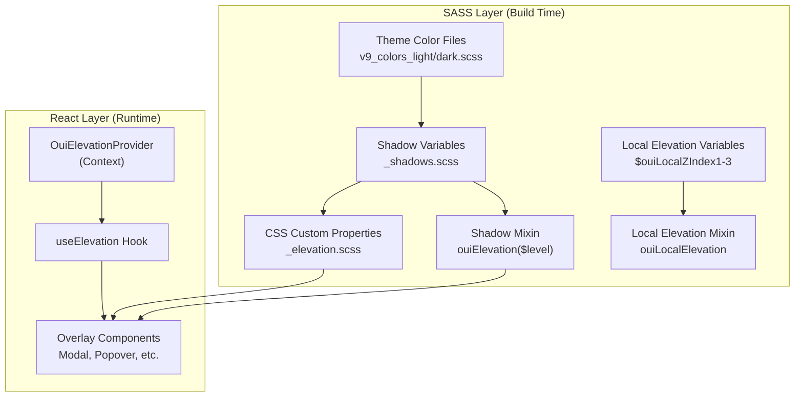

# Design Document: V9 Elevation System

## Overview

The v9 elevation system introduces a structured, token-based approach to shadows and stacking in OUI. It consists of four layers:

1. **Shadow tokens** — Six SASS variables and a mixin for consistent box-shadow application
2. **Theme-aware opacity** — Shadow opacity that adjusts automatically between light (0.32) and dark (0.80) themes
3. **Elevated surface tokens** — CSS custom properties for dark theme background/border contrast
4. **Dynamic overlay stacking** — A React context + hook (`useElevation`) for automatic z-index management of overlays

Shadow strength is intentionally decoupled from z-index. A component can use any shadow level regardless of its stacking position.

## Architecture

The system spans two layers of the OUI architecture:



### Key Design Decisions

1. **SASS variables over CSS custom properties for shadows**: Shadow tokens are SASS variables because the existing OUI shadow system uses SASS, and the box-shadow values are static per theme. CSS custom properties are used only for the elevated surface tokens that need runtime theme switching.

2. **Context-based z-index management**: A React context provider tracks overlay mount order and assigns z-index values. This avoids the current pattern of hardcoded z-index tiers (1000, 2000, etc.) for dynamic overlays.

3. **Starting z-index of 90**: The `useElevation` hook starts assigning z-index at 90 (incrementing by 10), leaving 1–89 for local elevation. This creates a clean boundary between local and global stacking.

4. **Mixin-based API**: The `ouiElevation($level)` mixin is the primary SASS API. It encapsulates the shadow value lookup and base layer, keeping component SCSS clean.

## Components and Interfaces

### SASS Components

#### 1. Shadow Variables (`src/themes/v9/global_styling/variables/_shadows.scss`)

Extends the existing shadow variables file with six new shadow level variables and a shadow opacity variable.

```scss
// Shadow opacity — overridden per theme
$ouiShadowOpacity: 0.32 !default;

// Base shadow layer (always present)
$ouiShadowBase: 0 0 1px rgba(0, 0, 0, 0.1);

// Shadow level definitions
$ouiShadow1: $ouiShadowBase, 0 1px 2px rgba(0, 0, 0, $ouiShadowOpacity);
$ouiShadow2: $ouiShadowBase, 0 1px 4px rgba(0, 0, 0, $ouiShadowOpacity);
$ouiShadow3: $ouiShadowBase, 0 2px 8px rgba(0, 0, 0, $ouiShadowOpacity);
$ouiShadow4: $ouiShadowBase, 0 3px 12px rgba(0, 0, 0, $ouiShadowOpacity);
$ouiShadow5: $ouiShadowBase, 0 4px 16px rgba(0, 0, 0, $ouiShadowOpacity);
$ouiShadow6: $ouiShadowBase, 0 5px 24px rgba(0, 0, 0, $ouiShadowOpacity);

// Local elevation z-index values
$ouiLocalZIndex1: 1;
$ouiLocalZIndex2: 2;
$ouiLocalZIndex3: 3;
```

#### 2. Shadow Mixin (`src/themes/v9/global_styling/mixins/_shadow.scss`)

Adds the `ouiElevation` and `ouiLocalElevation` mixins alongside the existing shadow mixins.

```scss
@mixin ouiElevation($level) {
  @if $level == 1 { box-shadow: $ouiShadow1; }
  @else if $level == 2 { box-shadow: $ouiShadow2; }
  @else if $level == 3 { box-shadow: $ouiShadow3; }
  @else if $level == 4 { box-shadow: $ouiShadow4; }
  @else if $level == 5 { box-shadow: $ouiShadow5; }
  @else if $level == 6 { box-shadow: $ouiShadow6; }
  @else { @warn "ouiElevation() expects level 1-6 but got '#{$level}'"; }
}

@mixin ouiLocalElevation {
  isolation: isolate;
}

@mixin ouiElevatedSurface {
  background-color: var(--oui-background-elevated);
  border-color: var(--oui-border-elevated);
}
```

#### 3. CSS Custom Properties (`src/themes/v9/global_styling/css_variables/_elevation.scss`)

Defines the elevated surface CSS custom properties, imported into the css_variables index.

```scss
// Light theme defaults (no visual effect)
:root {
  --oui-background-elevated: transparent;
  --oui-border-elevated: transparent;
}
```

Dark theme overrides are set in `v9_colors_dark.scss` via a SASS-generated `:root` block or a `.ouiTheme--dark` selector, depending on how the v9 theme applies dark mode. The dark values will be:

```scss
--oui-background-elevated: #{$ouiColorLightShade};  // Slate-800
--oui-border-elevated: #{transparentize(#475569, 0.5)};  // Slate-600 at 50%
```

#### 4. Theme Color Overrides

In `v9_colors_dark.scss`, the shadow opacity is overridden:

```scss
$ouiShadowOpacity: 0.80;
```

This must appear before the shadow variables are imported so the shadow level values use the dark opacity.

### React Components

#### 5. ElevationProvider (`src/services/elevation/elevation_provider.tsx`)

A React context provider that manages dynamic z-index assignment for overlay components.

```typescript
interface ElevationContextValue {
  register: () => number;    // Returns assigned z-index
  unregister: (zIndex: number) => void;
}

// Provider maintains a counter starting at 90, incrementing by 10
// register() returns the next z-index and increments the counter
// unregister() is called on unmount (counter does not decrement — 
// values are not reused within a provider lifecycle to avoid flicker)
```

#### 6. useElevation Hook (`src/services/elevation/use_elevation.ts`)

```typescript
interface UseElevationOptions {
  isEnabled?: boolean;  // defaults to true
}

interface UseElevationReturn {
  style: React.CSSProperties;  // { zIndex: number } or {}
}

function useElevation(options?: UseElevationOptions): UseElevationReturn;
```

When `isEnabled` is `true` (default), the hook calls `register()` on mount and `unregister()` on unmount, returning `{ style: { zIndex: assignedValue } }`. When `isEnabled` is `false`, it returns `{ style: {} }`.

## Data Models

### Shadow Level Map

| Level | Offset & Blur | Use Case |
|-------|--------------|----------|
| 1 | `0 1px 2px` | Small hovered elements (Buttons, Selects) |
| 2 | `0 1px 4px` | Large hovered elements (dashboard widgets, Modals) |
| 3 | `0 2px 8px` | DraggablePanes and Headers |
| 4 | `0 3px 12px` | Facets, Popovers, SearchBars, Toasts |
| 5 | `0 4px 16px` | Reserved (not currently used) |
| 6 | `0 5px 24px` | SidePanels |

### Z-Index Allocation

| Range | Owner | Purpose |
|-------|-------|---------|
| 1–89 | Local elevation (`$ouiLocalZIndex1-3`) | Within-component stacking |
| 90+ (step 10) | `useElevation` hook | Dynamic overlay stacking |

### ElevationContext State

```typescript
interface ElevationState {
  nextZIndex: number;  // starts at 90, increments by 10
}
```

### TypeScript Interfaces

```typescript
// src/services/elevation/elevation_context.ts
interface ElevationContextValue {
  register: () => number;
  unregister: (zIndex: number) => void;
}

// src/services/elevation/use_elevation.ts
interface UseElevationOptions {
  isEnabled?: boolean;
}

interface UseElevationReturn {
  style: React.CSSProperties;
}
```


### Documentation Page

#### 7. Elevation Example Page (`src-docs/src/views/elevation/`)

A documentation page showcasing the elevation system, following the standard OUI docs pattern.

**Files:**
- `elevation_example.js` — Example definitions and section configuration (exported as `ElevationExample`)
- `elevation_shadows.tsx` — Demo showing all 6 shadow levels as cards
- `elevation_dark_theme.tsx` — Demo showing elevated surface tokens in dark theme context
- `elevation_use_elevation.tsx` — Interactive demo of the `useElevation` hook with stackable overlays
- `elevation_local.tsx` — Demo showing local elevation with `isolation: isolate`

**Route registration:** Add import and entry in `src-docs/src/routes.js` under the "Theming" or "Utilities" navigation section.

**Demo structure:**
- Section 1: Shadow levels — Six cards, each with a different shadow level applied via `ouiElevation($level)`, labeled with level number and use case
- Section 2: Elevated surfaces — Side-by-side light/dark theme preview showing `--oui-background-elevated` and `--oui-border-elevated` in action
- Section 3: useElevation hook — Buttons that open stacked overlays (modal, popover, tooltip) demonstrating automatic z-index assignment
- Section 4: Local elevation — A component with internal stacking using `ouiLocalElevation` and `$ouiLocalZIndex` variables

## Correctness Properties

*A property is a characteristic or behavior that should hold true across all valid executions of a system — essentially, a formal statement about what the system should do. Properties serve as the bridge between human-readable specifications and machine-verifiable correctness guarantees.*

### Property 1: Shadow mixin produces correct box-shadow with base layer

*For any* valid shadow level (1–6), calling `ouiElevation($level)` SHALL produce a `box-shadow` value that contains exactly the base layer (`0 0 1px rgba(0, 0, 0, 0.1)`) and the level-specific shadow with the correct offset/blur values, and SHALL NOT include any `z-index` declaration.

**Validates: Requirements 1.2, 1.4, 7.2**

### Property 2: Theme-aware shadow opacity

*For any* shadow level (1–6) and *for any* theme (light or dark), the shadow `rgba()` alpha value in the level-specific shadow SHALL equal the theme's `$ouiShadowOpacity` value (0.32 for light, 0.80 for dark).

**Validates: Requirements 2.1, 2.2**

### Property 3: Sequential z-index assignment

*For any* sequence of N overlay components that call `useElevation({ isEnabled: true })`, the i-th component (1-indexed) SHALL receive a `style` object with `zIndex` equal to `90 + (i - 1) * 10`.

**Validates: Requirements 4.1, 4.2, 4.5**

### Property 4: Z-index cleanup on unmount

*For any* overlay component that has been assigned a z-index via `useElevation`, when that component unmounts, the provider's `unregister` function SHALL be called with the assigned z-index value.

**Validates: Requirements 4.3**

## Error Handling

### SASS Layer

- **Invalid shadow level**: The `ouiElevation($level)` mixin emits a `@warn` message when `$level` is not 1–6. No `box-shadow` is applied. This follows the existing OUI pattern (see `ouiOverflowShadow` in the current shadow mixin).
- **Missing provider**: Not applicable at the SASS layer.

### React Layer

- **Missing ElevationProvider**: If `useElevation` is called outside an `OuiElevationProvider`, the hook returns `{ style: {} }` (no z-index assigned). A console warning is emitted in development mode.
- **Rapid mount/unmount**: The provider uses a ref-based counter (not state) for z-index assignment to avoid unnecessary re-renders. Z-index values are not recycled within a provider lifecycle to prevent flicker from reuse.

## Testing Strategy

### Unit Tests (Jest + Enzyme / Testing Library)

Unit tests cover specific examples and edge cases:

- Shadow variables file contains all six `$ouiShadow` variables
- `ouiElevation` mixin with invalid level (0, 7, -1) emits SASS warning
- `useElevation({ isEnabled: false })` returns empty style object
- `useElevation()` defaults `isEnabled` to `true`
- CSS custom properties are `transparent` in light theme
- CSS custom properties have contrast values in dark theme
- `ouiLocalElevation` mixin outputs `isolation: isolate`
- Local z-index variables have correct values (1, 2, 3)
- `ouiElevatedSurface` mixin outputs correct CSS properties

### Property-Based Tests (fast-check)

Property-based tests validate universal properties across generated inputs. Each test runs a minimum of 100 iterations.

- **Feature: v9-elevation-system, Property 1: Shadow mixin produces correct box-shadow with base layer**
  - Generate random valid levels (1–6), verify mixin output matches expected box-shadow and contains no z-index
  
- **Feature: v9-elevation-system, Property 2: Theme-aware shadow opacity**
  - Generate random combinations of level (1–6) and theme (light/dark), verify opacity matches theme value

- **Feature: v9-elevation-system, Property 3: Sequential z-index assignment**
  - Generate random N (1–20), render N components using `useElevation`, verify each gets `90 + (i-1)*10`

- **Feature: v9-elevation-system, Property 4: Z-index cleanup on unmount**
  - Generate random N overlays, unmount a random subset, verify `unregister` is called with correct z-index values

### SASS Compilation Tests

SASS-specific tests compile SCSS snippets and verify the CSS output:

- Compile shadow variables and verify box-shadow values
- Compile with light theme colors and verify opacity
- Compile with dark theme colors and verify opacity
- Compile `ouiElevation` mixin calls and verify output
- Compile `ouiElevatedSurface` mixin and verify CSS custom property usage
