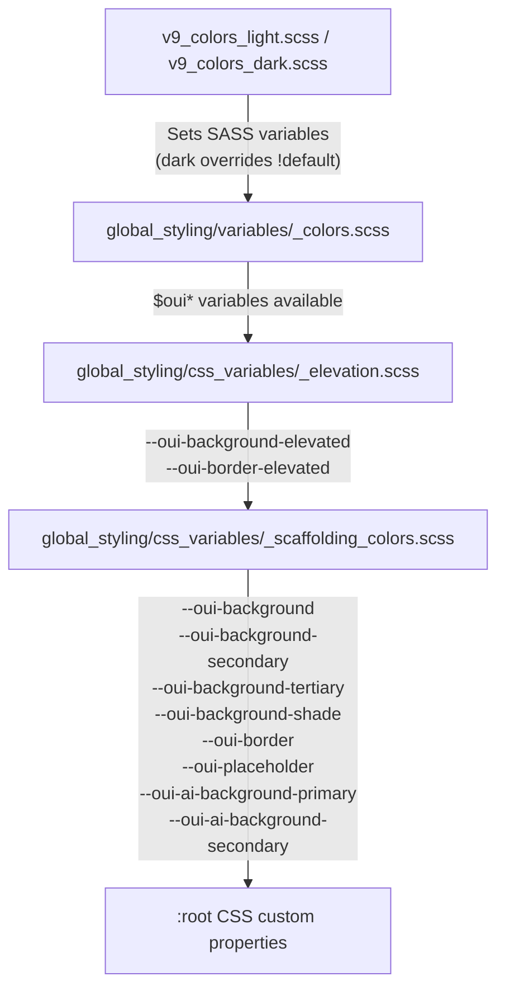

# Design Document: V9 Scaffolding Colors

## Overview

This feature introduces a set of DRUIDS-inspired scaffolding color CSS custom properties to the OUI v9 theme. These semantic tokens abstract structural UI color roles (backgrounds, borders, placeholders, AI surfaces) away from raw color values, enabling consistent theming across light and dark modes.

The implementation follows the established v9 pattern: SASS variables with `!default` values define light theme defaults, the dark theme color file overrides them before consumption, and a new CSS custom properties file exposes them on `:root`. This mirrors the existing elevation system (`_elevation.scss`) which already defines `--oui-background-elevated` and `--oui-border-elevated`.

### Design Decisions

1. **No re-declaration of elevation tokens**: `--oui-background-elevated` and `--oui-border-elevated` remain in `_elevation.scss`. The new scaffolding file complements rather than duplicates them.
2. **SASS variables live in the color files**: Light defaults go in `global_styling/variables/_colors.scss` (using `!default`), dark overrides go in `v9_colors_dark.scss` (without `!default`). This matches the existing pattern for `$ouiBackgroundElevated` and `$ouiBorderElevated`.
3. **CSS custom properties in a dedicated file**: A new `_scaffolding_colors.scss` in `css_variables/` maps SASS variables to CSS custom properties, imported after `_elevation.scss`.
4. **`--oui-` prefix**: All custom properties use the established `--oui-` prefix with kebab-case naming.
5. **AI tokens are speculative**: The `--oui-ai-background-primary` and `--oui-ai-background-secondary` tokens use accent-derived colors. These can be refined as AI features mature.

## Architecture

The scaffolding color system integrates into the existing v9 theme pipeline:



### Import Order

The theme entry points (`theme_v9_light.scss`, `theme_v9_dark.scss`) load:
1. Color file (`v9_colors_dark.scss` or `v9_colors_light.scss`) — sets SASS variable overrides
2. `global_styling/index.scss` — which loads:
   - `variables/_colors.scss` — defines `!default` SASS variables (light defaults)
   - `css_variables/_index.scss` — loads `_elevation.scss` then `_scaffolding_colors.scss`

Because the dark color file is imported first and sets variables without `!default`, those values take precedence over the `!default` declarations in `_colors.scss`.

## Components and Interfaces

### New File: `src/themes/v9/global_styling/css_variables/_scaffolding_colors.scss`

This file reads SASS variables and emits CSS custom properties on `:root`.

```scss
/*
 * Copyright OpenSearch Contributors
 * SPDX-License-Identifier: Apache-2.0
 */

:root {
  // Backgrounds
  --oui-background: #{$ouiBackgroundColor};
  --oui-background-secondary: #{$ouiBackgroundSecondary};
  --oui-background-tertiary: #{$ouiBackgroundTertiary};
  --oui-background-shade: #{$ouiBackgroundShade};

  // Borders
  --oui-border: #{$ouiBorderColor};

  // Placeholder
  --oui-placeholder: #{$ouiPlaceholderColor};

  // AI surfaces
  --oui-ai-background-primary: #{$ouiAiBackgroundPrimary};
  --oui-ai-background-secondary: #{$ouiAiBackgroundSecondary};
}
```

### Modified File: `src/themes/v9/global_styling/css_variables/_index.scss`

Add the import for the new scaffolding colors file after elevation:

```scss
@import 'fonts';
@import 'elevation';
@import 'scaffolding_colors';
```

### Modified File: `src/themes/v9/global_styling/variables/_colors.scss`

Add light theme `!default` SASS variables (placed after the existing background/highlight variables, before the computed text color variables):

```scss
// Scaffolding color defaults (light theme)
$ouiBackgroundColor: $ouiColorEmptyShade !default;           // #FFFFFF
$ouiBackgroundSecondary: $ouiColorLightestShade !default;    // Slate-50 (#F8FAFC)
$ouiBackgroundTertiary: $ouiColorLightShade !default;        // Slate-200 (#E2E8F0)
$ouiBackgroundShade: $ouiColorDarkestShade !default;         // Slate-800 (#1E293B)
$ouiPlaceholderColor: $ouiColorLightShade !default;          // Slate-200 (#E2E8F0)
$ouiAiBackgroundPrimary: tintOrShade($ouiColorAccent, 90%, 70%) !default;
$ouiAiBackgroundSecondary: tintOrShade($ouiColorAccent, 95%, 80%) !default;
```

### Modified File: `src/themes/v9/v9_colors_dark.scss`

Add dark theme overrides (without `!default`) alongside the existing elevated surface overrides:

```scss
// Scaffolding color overrides for dark theme
$ouiBackgroundColor: $ouiColorEmptyShade;          // Slate-950 (#020617)
$ouiBackgroundSecondary: $ouiColorLightestShade;   // Slate-900 (#0F172A)
$ouiBackgroundTertiary: $ouiColorLightShade;       // Slate-800 (#1E293B)
$ouiBackgroundShade: #334155;                      // Slate-700
$ouiPlaceholderColor: $ouiColorLightestShade;      // Slate-900 (#0F172A)
$ouiAiBackgroundPrimary: transparentize($ouiColorAccent, 0.85);
$ouiAiBackgroundSecondary: transparentize($ouiColorAccent, 0.92);
```

### Relationship to Existing Elevation Tokens

| Token | Source | Notes |
|-------|--------|-------|
| `--oui-background-elevated` | `_elevation.scss` | Unchanged. Light: `transparent`, Dark: Slate-800 |
| `--oui-border-elevated` | `_elevation.scss` | Unchanged. Light: `transparent`, Dark: Slate-600 at 50% |
| `--oui-background` | `_scaffolding_colors.scss` | New. Standard background |
| `--oui-background-secondary` | `_scaffolding_colors.scss` | New. Subtle contrast background |
| `--oui-background-tertiary` | `_scaffolding_colors.scss` | New. Stronger contrast background |
| `--oui-background-shade` | `_scaffolding_colors.scss` | New. Inverted-style surfaces (Toast, Tooltip) |
| `--oui-border` | `_scaffolding_colors.scss` | New. Standard border color |
| `--oui-placeholder` | `_scaffolding_colors.scss` | New. Loading skeleton fill |
| `--oui-ai-background-primary` | `_scaffolding_colors.scss` | New. Primary AI surface |
| `--oui-ai-background-secondary` | `_scaffolding_colors.scss` | New. Secondary AI surface |

## Data Models

This feature is purely CSS/SASS — there are no TypeScript data models, React components, or runtime data structures. The "data" is the set of SASS variables and their mappings to CSS custom properties.

### Token Value Map

| CSS Custom Property | Light Theme Value | Dark Theme Value |
|---|---|---|
| `--oui-background` | `#FFFFFF` (white) | `#020617` (Slate-950) |
| `--oui-background-secondary` | `#F8FAFC` (Slate-50) | `#0F172A` (Slate-900) |
| `--oui-background-tertiary` | `#E2E8F0` (Slate-200) | `#1E293B` (Slate-800) |
| `--oui-background-shade` | `#1E293B` (Slate-800) | `#334155` (Slate-700) |
| `--oui-border` | `#E2E8F0` (Slate-200) | `rgba(#334155, 0.5)` (Slate-700 at 50%) |
| `--oui-placeholder` | `#E2E8F0` (Slate-200) | `#0F172A` (Slate-900) |
| `--oui-ai-background-primary` | `tintOrShade($ouiColorAccent, 90%, 70%)` | `rgba($ouiColorAccent, 0.15)` |
| `--oui-ai-background-secondary` | `tintOrShade($ouiColorAccent, 95%, 80%)` | `rgba($ouiColorAccent, 0.08)` |


## Correctness Properties

*A property is a characteristic or behavior that should hold true across all valid executions of a system — essentially, a formal statement about what the system should do. Properties serve as the bridge between human-readable specifications and machine-verifiable correctness guarantees.*

Most acceptance criteria in this feature are specific example checks (compile theme X, verify value Y). However, several naming convention requirements are true properties that hold across all tokens.

### Property 1: CSS custom property naming convention

*For any* CSS custom property declared in `_scaffolding_colors.scss`, the property name must match the pattern `--oui-` followed by one or more kebab-case segments (lowercase letters, digits, and hyphens).

**Validates: Requirements 5.3**

### Property 2: Dark theme scaffolding overrides omit !default

*For any* scaffolding color SASS variable override in `v9_colors_dark.scss`, the declaration must not include the `!default` flag, ensuring dark values always take precedence over light defaults.

**Validates: Requirements 5.5**

### Property 3: Light theme scaffolding defaults use !default

*For any* scaffolding color SASS variable defined in `global_styling/variables/_colors.scss`, the declaration must include the `!default` flag, allowing theme color files to override them.

**Validates: Requirements 5.4**

## Error Handling

This feature is a SASS/CSS token system with no runtime error paths. Errors manifest as:

1. **SASS compilation failures**: If a SASS variable is referenced before it's defined (import order issue), the SASS compiler will fail with an "undefined variable" error. The import order (color file → variables → css_variables) prevents this.
2. **Missing dark overrides**: If a scaffolding variable is not overridden in the dark theme file, the `!default` light value will be used, resulting in incorrect contrast. This is caught by the compilation tests that verify expected dark values.
3. **Duplicate CSS custom property declarations**: If `--oui-background-elevated` or `--oui-border-elevated` were accidentally re-declared in the scaffolding file, the later declaration would override the elevation system's values. The test for Requirement 4.1 guards against this.

No runtime error handling code is needed.

## Testing Strategy

### Unit Tests (Jest)

Since this project does not have existing SASS compilation tests and fast-check is not installed, testing will use Jest unit tests that compile SASS and inspect the CSS output.

**SASS Compilation Tests** (`src/themes/v9/global_styling/css_variables/_scaffolding_colors.test.ts`):

1. **Light theme values**: Compile the light theme entry point and verify all 8 CSS custom properties are present in the `:root` block with expected light values.
   - _Validates: Requirements 1.1–1.7, 3.1–3.8_

2. **Dark theme values**: Compile the dark theme entry point and verify all 8 CSS custom properties are present with expected dark values.
   - _Validates: Requirements 2.1–2.7, 3.1–3.8_

3. **No elevation token re-declaration**: Verify the scaffolding colors file output does not contain `--oui-background-elevated` or `--oui-border-elevated`.
   - _Validates: Requirements 4.1_

4. **Import order**: Verify `_index.scss` imports `scaffolding_colors` after `elevation`.
   - _Validates: Requirements 4.2_

### Property-Based Tests (fast-check)

Property-based tests will use `fast-check` (to be installed as a dev dependency) with Jest. Each test runs a minimum of 100 iterations.

1. **Feature: v9-scaffolding-colors, Property 1: CSS custom property naming convention**
   - Generate random subsets of the declared CSS custom properties from the compiled output, verify each matches `--oui-[a-z0-9-]+`.
   - _Validates: Requirements 5.3_

2. **Feature: v9-scaffolding-colors, Property 2: Dark theme scaffolding overrides omit !default**
   - Parse the dark theme color file, extract all scaffolding variable declarations, verify none contain `!default`.
   - _Validates: Requirements 5.5_

3. **Feature: v9-scaffolding-colors, Property 3: Light theme scaffolding defaults use !default**
   - Parse the light theme defaults file, extract all scaffolding variable declarations, verify all contain `!default`.
   - _Validates: Requirements 5.4_

### File Convention Tests

5. **File exists at correct path**: Verify `_scaffolding_colors.scss` exists in `src/themes/v9/global_styling/css_variables/`.
   - _Validates: Requirements 5.1_

6. **License header present**: Verify the file starts with the Apache 2.0 license header.
   - _Validates: Requirements 5.2_
